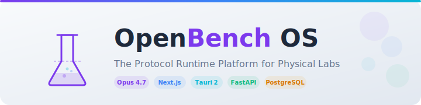
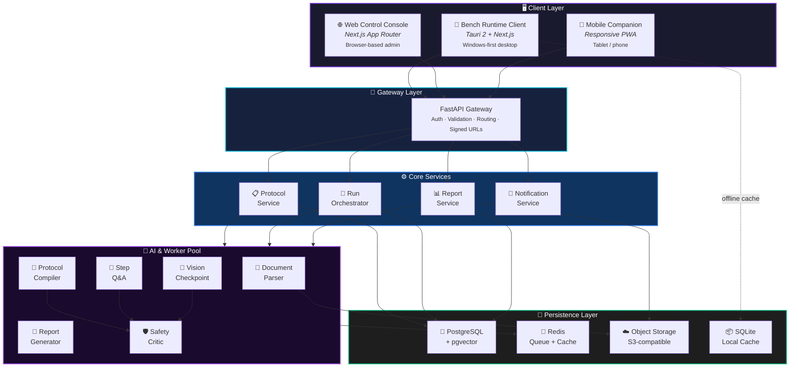
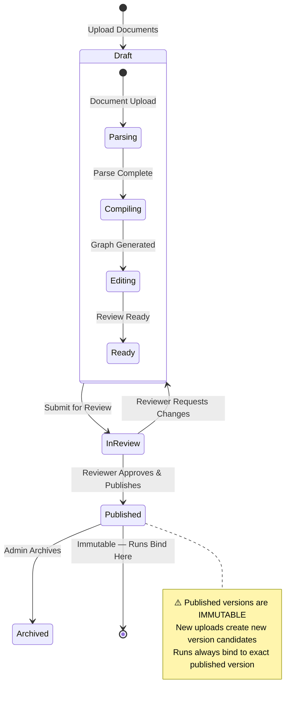
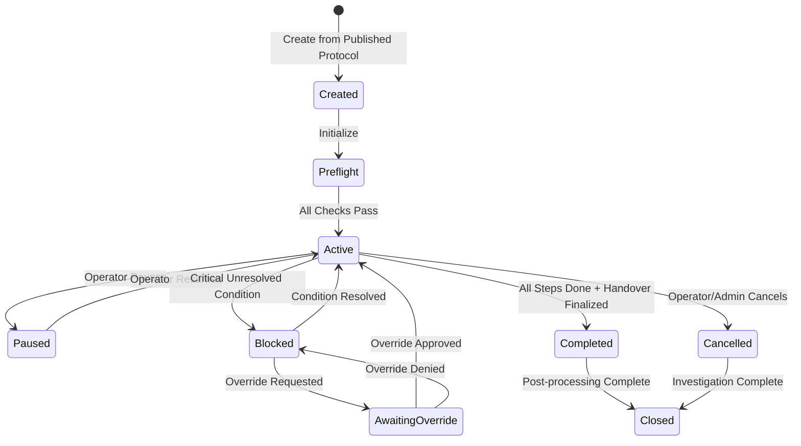
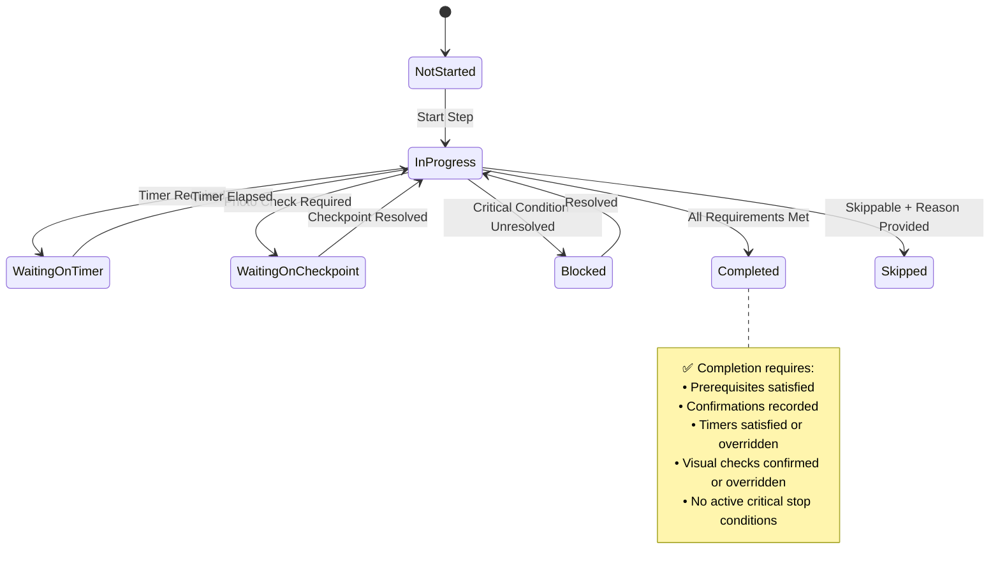
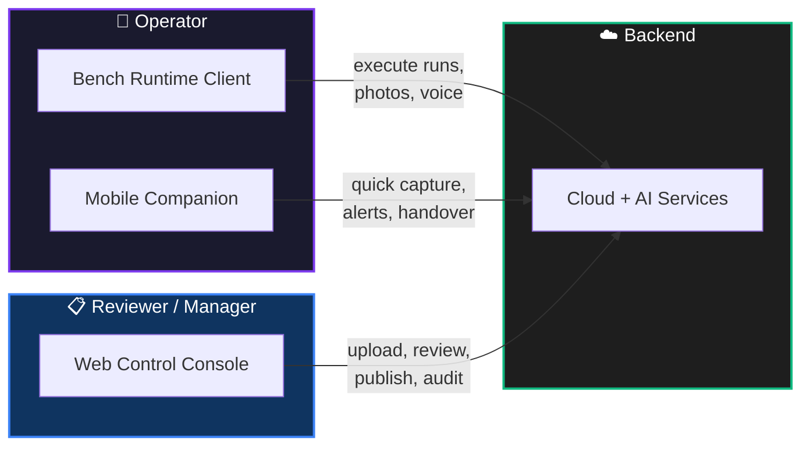
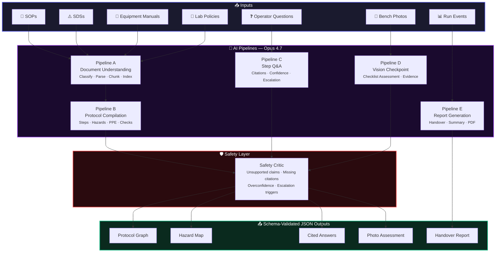
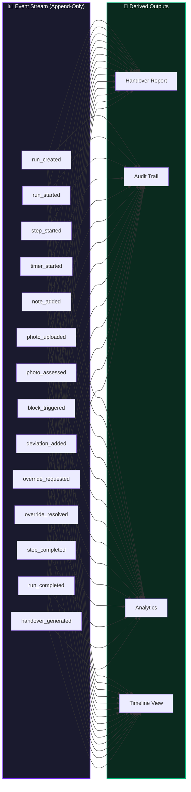
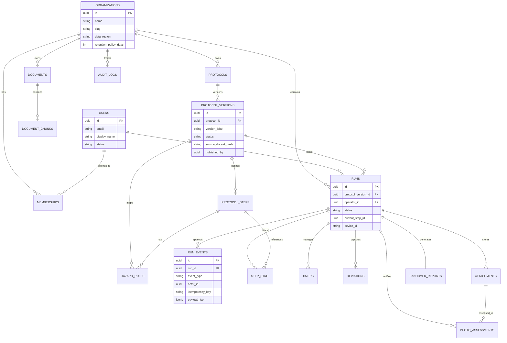

<div align="center">

<!-- Logo / Hero Banner -->
<picture>
  <source media="(prefers-color-scheme: dark)" srcset="docs/assets/banner-dark.svg">
  <source media="(prefers-color-scheme: light)" srcset="docs/assets/banner-light.svg">
  
</picture>

<br/>

# 🧬 OpenBench OS

### *The Protocol Runtime Platform for Physical Labs*

**Compile approved SOPs, SDSs, and equipment manuals into governed execution graphs — then run them with checkpoints, photo verification, voice assistance, deviation capture, and event-sourced handover reports.**

<br/>

[](LICENSE)
[](https://github.com/yuki-20/OS-Bench)
[](https://www.anthropic.com)
[](https://github.com/yuki-20/OS-Bench)
[](docs/product/)

<br/>

[**Getting Started**](#-getting-started) · [**Architecture**](#-architecture) · [**Product Surfaces**](#-product-surfaces) · [**AI System**](#-ai-system) · [**API Reference**](#-api-reference) · [**Contributing**](#-contributing)

---

</div>

<br/>

## 🔬 The Problem

Labs have **approved documents** — SOPs, SDSs, equipment manuals, chemical hygiene plans. But at the moment of execution, operators are still flipping through PDFs, interpreting dense safety sheets from memory, and reconstructing what happened in shift handovers **after** the work is done.

> **Approved documents exist. The executable runtime usually does not.**
>
> **OpenBench OS creates that runtime.**

<br/>

## ✨ What OpenBench OS Does

OpenBench OS **compiles** approved lab documents into **versioned execution graphs**, then **runs** those graphs through:

| Capability | Description |
|:---|:---|
| 📋 **Protocol Compilation** | Transforms SOPs + SDSs + manuals into structured, reviewable execution graphs |
| 🔒 **Immutable Versioning** | Published protocols are frozen — every run binds to an exact version |
| ⚙️ **Explicit Run Engine** | Step-by-step execution with state machines, blockers, timers, and confirmations |
| 📸 **Photo Verification** | Vision-based checkpoint verification against step-specific checklists |
| ⚠️ **Deviation Capture** | Log deviations in real-time, not after the fact |
| 📊 **Event-Sourced Handover** | Reports generated from actual recorded events, not chat memory |
| 🔍 **Source Citations** | Every safety-relevant claim maps to source evidence |
| 🤖 **AI Trace Panel** | Full operational traceability for every AI output |

<br/>

## 🚫 What This Is NOT

| ❌ Not This | ✅ But This |
|:---|:---|
| Chat with SOPs | A protocol **runtime** with governed state |
| Generic AI wrapper | Schema-validated AI pipelines with citations |
| ELN replacement | An **execution layer** that complements ELNs |
| Lab automation platform | A **document intelligence + run engine** platform |
| Autonomous experiment designer | A **guided execution** system for approved procedures |

<br/>

---

## 🏗️ Architecture

### High-Level System Architecture



<br/>

### Protocol Lifecycle



<br/>

### Run Engine State Machine



<br/>

### Step Lifecycle



<br/>

---

## 🖥️ Product Surfaces

### Surface Overview



<br/>

### 🧪 Surface A — Bench Runtime Client

> **Windows-first installable desktop application** for operators at the bench.

- **Tech:** Tauri 2 shell wrapping shared Next.js/React UI
- **Offline:** Encrypted SQLite local cache, event journaling, retry/sync
- **Key Screens:** Home → Protocol Library → Preflight → Live Run → Photo Check → Deviation → Handover Preview → Sync Status

```
/app/home
/app/protocols
/app/protocols/{protocolVersionId}
/app/runs
/app/runs/{runId}
/app/runs/{runId}/checkpoint/{stepId}
/app/runs/{runId}/deviation
/app/runs/{runId}/handover
/app/sync
/app/settings
```

### 🌐 Surface B — Web Control Console

> **Browser-based admin/reviewer surface** for protocol management, run oversight, and audit.

- **Users:** Reviewers, Lab Managers, EHS/Safety Leads, Org Admins
- **Key Screens:** Dashboard → Upload Workspace → Protocol Draft Review → Published Version View → Run Detail → Deviation Queue → Team Admin → Settings

```
/console/dashboard
/console/protocols
/console/protocols/new
/console/protocols/{draftId}/review
/console/protocols/{versionId}
/console/runs
/console/runs/{runId}
/console/deviations
/console/reports
/console/team
/console/settings
/console/audit
```

### 📱 Surface C — Tablet / Mobile Companion

> **Responsive PWA** for photo capture, step review, alerts, and handover consumption.

### ☁️ Surface D — Cloud + AI Services

> **Backend platform** powering document ingestion, protocol compilation, run orchestration, photo verification, reporting, and audit.

<br/>

---

## 🤖 AI System

### Opus 4.7 Pipeline Architecture



<br/>

### AI Trace Panel

Every AI output includes an operational trace — not chain-of-thought, but auditable metadata:

| Field | Description |
|:---|:---|
| `task_type` | compilation, step_qa, photo_check, safety_critic, report |
| `model` | The model used (e.g., Opus 4.7) |
| `source_documents` | Documents and chunks consumed |
| `protocol_version` | Bound protocol version ID |
| `current_step` | Active step context |
| `output_schema` | Schema name validated against |
| `citation_coverage` | Percentage of claims with source backing |
| `confidence_flags` | Per-item confidence and uncertainty |
| `safety_critic_result` | Pass / flagged / escalated |
| `state_mutation` | Whether the output changed run state |
| `human_review_required` | Whether human approval is needed |

<br/>

### Cross-Document Reasoning Example

> 🧠 **Why this matters:** Opus 4.7 doesn't just retrieve — it **synthesizes** across documents.

```
📄 SOP says:        "Wear compatible gloves"
⚠️ SDS specifies:   "Nitrile gloves required"
📘 Manual warns:    "No wet gloves near control panel"

    ↓ OpenBench maps all three into Step 4's control card
    ↓ Each source is cited independently
    ↓ Operator sees unified, actionable guidance
```

<br/>

---

## 🔄 Event-Sourced Architecture

### Why Events Matter

OpenBench OS uses **append-only event capture** as its source of truth:



Each event includes: `event_id` · `run_id` · `event_type` · `actor_id` · `device_id` · `step_id` · `timestamp` · `payload_json` · `local_seq` · `idempotency_key` · `server_timestamp`

<br/>

---

## 📡 API Reference

### Core Endpoints

<details>
<summary><b>🔐 Authentication</b></summary>

| Method | Path | Purpose |
|:---|:---|:---|
| `POST` | `/api/auth/login` | Sign in |
| `POST` | `/api/auth/refresh` | Refresh session token |
| `POST` | `/api/auth/logout` | Revoke session |
| `GET` | `/api/auth/me` | Current user + memberships |

</details>

<details>
<summary><b>📄 Documents & Protocols</b></summary>

| Method | Path | Purpose |
|:---|:---|:---|
| `POST` | `/api/documents/upload` | Upload document, get signed URL |
| `POST` | `/api/documents/{id}/finalize` | Trigger parsing |
| `GET` | `/api/documents/{id}` | Document metadata |
| `GET` | `/api/documents/{id}/chunks` | Chunks & citations |
| `POST` | `/api/protocol-drafts/compile` | Compile draft from documents |
| `GET` | `/api/protocol-drafts/{id}` | Fetch compiled draft |
| `PATCH` | `/api/protocol-drafts/{id}` | Edit draft during review |
| `POST` | `/api/protocol-drafts/{id}/publish` | Publish immutable version |
| `GET` | `/api/protocol-versions/{id}` | Fetch published version |
| `POST` | `/api/protocol-versions/{id}/archive` | Archive version |

</details>

<details>
<summary><b>🔄 Runs</b></summary>

| Method | Path | Purpose |
|:---|:---|:---|
| `POST` | `/api/runs` | Create run from protocol version |
| `GET` | `/api/runs/{id}` | Run state & summary |
| `POST` | `/api/runs/{id}/start` | Transition to active |
| `POST` | `/api/runs/{id}/pause` | Pause run |
| `POST` | `/api/runs/{id}/resume` | Resume run |
| `POST` | `/api/runs/{id}/steps/{stepId}/start` | Start step |
| `POST` | `/api/runs/{id}/steps/{stepId}/complete` | Complete step (validates rules) |
| `POST` | `/api/runs/{id}/steps/{stepId}/skip` | Skip if permitted |
| `POST` | `/api/runs/{id}/notes` | Add note |
| `POST` | `/api/runs/{id}/measurements` | Add measurement |
| `POST` | `/api/runs/{id}/deviations` | Add deviation |
| `POST` | `/api/runs/{id}/timers` | Start timer |
| `POST` | `/api/runs/{id}/override-requests` | Request override |

</details>

<details>
<summary><b>🤖 AI & Checkpoints</b></summary>

| Method | Path | Purpose |
|:---|:---|:---|
| `POST` | `/api/runs/{id}/ask` | Step-scoped Q&A |
| `POST` | `/api/runs/{id}/steps/{stepId}/photo-check` | Photo checkpoint assessment |
| `GET` | `/api/runs/{id}/steps/{stepId}/photo-assessments` | List assessments |

</details>

<details>
<summary><b>📊 Reports & Audit</b></summary>

| Method | Path | Purpose |
|:---|:---|:---|
| `POST` | `/api/runs/{id}/handover/generate` | Generate handover report |
| `GET` | `/api/runs/{id}/handover` | Fetch current report |
| `POST` | `/api/runs/{id}/handover/finalize` | Finalize handover |
| `GET` | `/api/runs/{id}/handover/pdf` | Download PDF |
| `GET` | `/api/admin/audit` | Query audit records |

</details>

<br/>

---

## 🗄️ Data Model

### Entity Relationship Diagram



<br/>

---

## 👥 Roles & Permissions

```mermaid
graph TB
    subgraph ROLES["Role Hierarchy"]
        OP["🧪 Operator"]
        RV["📋 Reviewer"]
        MG["👔 Manager"]
        SL["🛡️ Safety Lead"]
        AD["⚙️ Org Admin"]
    end

    subgraph PERMISSIONS["Permissions"]
        direction LR
        P1["Start/Execute Runs"]
        P2["Upload Photos & Notes"]
        P3["Request Overrides"]
        P4["Review/Edit Drafts"]
        P5["Publish Protocols"]
        P6["Approve Overrides"]
        P7["Assign Protocols"]
        P8["Export Reports"]
        P9["Manage Safety Overlays"]
        P10["Configure Escalations"]
        P11["Manage Users & Settings"]
        P12["Org Audit Access"]
    end

    OP --> P1 & P2 & P3
    RV --> P4 & P5 & P6
    MG --> P6 & P7 & P8
    SL --> P9 & P10
    AD --> P11 & P12

    style ROLES fill:#1a1a2e,stroke:#7C3AED,stroke-width:2px,color:#fff
    style PERMISSIONS fill:#0f3460,stroke:#3B82F6,stroke-width:2px,color:#fff
```



| Permission | Operator | Reviewer | Manager | Safety Lead | Org Admin |
|:---|:---:|:---:|:---:|:---:|:---:|
| Start run | ✅ | — | — | — | — |
| Upload photo / add note | ✅ | — | — | — | — |
| Request override | ✅ | — | — | — | — |
| Edit draft protocol | — | ✅ | — | — | — |
| Publish protocol | — | ✅ | — | — | — |
| Review flagged runs | — | ✅ | — | — | — |
| Approve overrides | — | ✅ | ✅ | — | — |
| Assign protocols | — | — | ✅ | — | — |
| View team runs | — | — | ✅ | — | — |
| Export reports | — | — | ✅ | — | — |
| Manage safety overlays | — | — | — | ✅ | — |
| Review escalations | — | — | — | ✅ | — |
| Manage users & settings | — | — | — | — | ✅ |
| Org-wide audit access | — | — | — | — | ✅ |

<br/>

---

## 🗂️ Repository Structure

```
openbench/
├── apps/
│   ├── console-web/          # Next.js control console (reviewer/admin)
│   └── bench-desktop/        # Tauri 2 shell (operator runtime)
├── packages/
│   ├── ui/                   # Shared React component library
│   ├── schemas/              # Shared Zod / JSON schemas
│   └── client-core/          # Sync client, storage abstractions
├── services/
│   ├── api/                  # FastAPI gateway + domain services
│   └── workers/              # Background jobs & AI pipelines
├── infra/
│   ├── docker/               # Container definitions
│   ├── k8s/                  # Kubernetes manifests
│   ├── migrations/           # Alembic database migrations
│   └── scripts/              # Dev/deploy scripts
└── docs/
    ├── product/              # PRD, specs, decision records
    ├── architecture/         # Architecture docs & diagrams
    └── runbooks/             # Operational runbooks
```

<br/>

---

## ⚡ Tech Stack

| Layer | Technology | Rationale |
|:---|:---|:---|
| **Shared Frontend** | Next.js App Router + React + TypeScript | Shared component model across web + desktop |
| **Styling** | Tailwind CSS + shadcn/ui | Rapid, consistent UI development |
| **State** | TanStack Query + Zustand | Server-state sync + local UI state |
| **Validation** | Zod | Shared schema validation client ↔ server |
| **Desktop Shell** | Tauri 2 | Lightweight native wrapper, encrypted SQLite cache |
| **Backend API** | FastAPI + Pydantic | Typed Python APIs, JSON-schema contracts |
| **ORM** | SQLAlchemy + Alembic | Migrations and query layer |
| **Jobs** | Redis + Celery | Async document parsing, AI pipelines, reports |
| **Database** | PostgreSQL + pgvector | Transactional state + vector retrieval |
| **Object Storage** | S3-compatible | Documents, photos, report artifacts |
| **Observability** | Sentry + PostHog + OpenTelemetry | Error tracking, analytics, metrics/tracing |
| **CI/CD** | GitHub Actions + Docker | Automated testing and deployment |

<br/>

---

## 🎯 Evaluation & Testing

### Golden Test Sets

| # | Protocol Pack | Validates |
|:---|:---|:---|
| 1 | Non-hazardous equipment setup | Basic step extraction, timers |
| 2 | Chemical handling with SDS | Hazard mapping, PPE, cross-doc reasoning |
| 3 | Instrument calibration checklist | Measurement capture, visual checks |
| 4 | Cleaning/decontamination SOP | Stop conditions, escalation triggers |
| 5 | Shift handover procedure | Event coverage, report generation |

### V1 Pass/Fail Targets

| Evaluation Area | Target |
|:---|:---|
| Protocol step extraction accuracy | ≥ 85% |
| Safety/PPE/control claims with citations | 100% |
| Critical unsupported operator-facing claims | 0 |
| Visual false-safe rate on critical missing items | 0 |
| Correct use of "cannot-verify" for hidden conditions | ≥ 90% |
| Handover report event coverage | ≥ 95% |
| Prompt-injection rejection (safety-critical) | 100% |
| Step Q&A citation coverage | ≥ 95% |
| Run state stored outside model | 100% |
| Published protocol version binding | 100% |

### Vision Test Set (12 staged images)

Correct setup · Missing label · Missing secondary containment · Wrong tube count · Blurry label · Blocked required item · Wrong container type · Spill-like prop · Unreadable display · Overcluttered bench · Partially occluded item · Cannot-verify condition

<br/>

---

## 🚀 Getting Started

### Prerequisites

- **Node.js** ≥ 20
- **Python** ≥ 3.11
- **Rust** (for Tauri 2)
- **PostgreSQL** ≥ 15
- **Redis** ≥ 7
- **Docker** (recommended)

### Quick Start

```bash
# Clone
git clone https://github.com/yuki-20/OS-Bench.git
cd OS-Bench

# Install frontend dependencies
npm install

# Install backend dependencies
cd services/api && pip install -r requirements.txt

# Start infrastructure
docker compose up -d postgres redis minio

# Run database migrations
cd services/api && alembic upgrade head

# Start the API server
uvicorn app.main:app --reload

# Start the web console (new terminal)
cd apps/console-web && npm run dev

# Start the desktop client (new terminal)
cd apps/bench-desktop && npm run tauri dev
```

<br/>

---

## 📋 Roadmap

```mermaid
gantt
    title OpenBench OS Roadmap
    dateFormat  YYYY-Q
    axisFormat  %Y-Q%q

    section Phase 0 — Foundation
    Auth, Orgs, Roles                    :done, p0a, 2026-Q2, 30d
    Document Ingestion                   :done, p0b, after p0a, 30d
    Protocol Drafts + Publish            :active, p0c, after p0b, 30d
    Core Run Engine + Desktop Shell      :p0d, after p0c, 45d

    section Phase 1 — Full V1
    Photo Checkpoint Engine              :p1a, after p0d, 30d
    Offline Queue & Sync                 :p1b, after p0d, 45d
    Deviation & Override Workflows       :p1c, after p1a, 30d
    Console + Audit + PDF Export         :p1d, after p1c, 30d
    Accessibility Baseline               :p1e, after p1d, 15d

    section Phase 1.1 — Trust & Polish
    Team Dashboards                      :p2a, after p1e, 30d
    Improved OCR & Handover Templates    :p2b, after p1e, 30d
    Webhook Exports                      :p2c, after p2a, 15d

    section Phase 2 — Adoption
    SSO/SCIM + ELN Integrations          :p3a, after p2c, 60d
    Training Simulator                   :p3b, after p2c, 45d
    Barcode/QR Module                    :p3c, after p3a, 30d
```

<br/>

---

## 🔒 Security & Privacy

- **TLS** in transit, **encryption at rest** for database and object storage
- **Encrypted SQLite** local cache for desktop client
- **Row-level tenant isolation** in PostgreSQL
- **Short-lived tokens** with refresh flow
- **Signed URLs** for all object access
- **No training on customer data** — documents are never used to train models
- **Configurable retention and deletion** windows
- **Audit logs** for all state-changing actions

<br/>

---

## ♿ Accessibility

OpenBench OS treats hands-busy, gloved, time-pressured workflows as **first-class use cases**:

- ⌨️ Full keyboard navigation
- 🔳 High contrast theme
- 🎯 Large target mode
- 🔊 Text-to-speech for current step
- 🔁 Repeat-last-instruction action
- 📏 Readable text scaling
- 🎤 Voice commands (with equivalent touch/keyboard actions)
- 📝 Accessible photo-check result summaries (not image-only)

<br/>

---

## 🤝 Contributing

We welcome contributions! Please see [CONTRIBUTING.md](CONTRIBUTING.md) for guidelines.

1. Fork the repository
2. Create a feature branch (`git checkout -b feature/amazing-feature`)
3. Commit your changes (`git commit -m 'feat: add amazing feature'`)
4. Push to the branch (`git push origin feature/amazing-feature`)
5. Open a Pull Request

<br/>

---

## 📄 License

This project is licensed under the MIT License — see the [LICENSE](LICENSE) file for details.

<br/>

---

<div align="center">

**Built with 🧠 Opus 4.7 · ⚛️ Next.js · 🦀 Tauri 2 · 🐍 FastAPI · 🐘 PostgreSQL**

<br/>

*OpenBench OS — Not chat with SOPs. A protocol runtime.*

</div>
